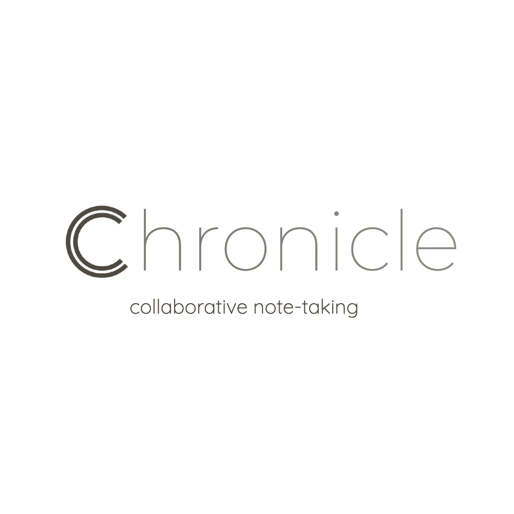

# Chronicle

Chronicle is a real-time collaborative note-taking application designed to streamline teamwork and personal productivity. With its intuitive interface and seamless real-time updates, Chronicle empowers users to create, edit, and share notes effortlessly.

## Features

- **Real-time Collaboration**: Multiple users can edit the same note simultaneously, with changes reflected instantly for all participants.
- **Markdown Support**: Format notes using Markdown for enhanced readability and organization.
- **User Management**: Create accounts, log in securely, and manage notes with ease.
- **Version History**: Maintain a history of changes for each note, allowing users to revert to previous versions if needed.
- **Sharing**: Share notes with others via a unique link or invite collaborators directly.

## Technologies Used

- **Backend**: .net core, Node.js, NestJs, SignalR, MongoDB
- **Frontend**: React.js, SignalR-client
- **Authentication**: JSON Web Tokens (JWT)
- **Styling**: CSS (with optional frameworks like Bootstrap or Material UI)
- **Deployment**: Heroku, Netlify (or other preferred hosting platforms)

## Getting Started

Follow these steps to set up Chronicle locally:

1. Clone the repository: `git clone https://github.com/your_username/chronicle.git`
2. Navigate to the project directory: `cd chronicle`
3. Install dependencies: `npm install`
4. Start the backend server: `npm run start:server`
5. Start the frontend development server: `npm run start:client`
6. Access Chronicle in your web browser at `http://localhost:3000`

## How to Use

1. **Sign Up/Login**: Create a new account or log in securely to access your notes.
2. **Create/Edit Notes**: Start jotting down your thoughts, ideas, or meeting notes. Use Markdown for formatting.
3. **Collaborate in Real-time**: Share notes with colleagues or friends and work together simultaneously.
4. **Manage Notes**: Organize your notes, view version history, and revert to previous versions if needed.
5. **Share and Collaborate**: Share notes via a unique link or invite collaborators directly for seamless teamwork.

## Contributing

Contributions are welcome! If you have any suggestions, bug reports, or feature requests, feel free to open an issue or submit a pull request.

## License

This project is licensed under the [MIT License](LICENCE.txt).

---

Feel free to reach out to us with any questions, feedback, or collaboration opportunities. Happy note-taking with Chronicle!
